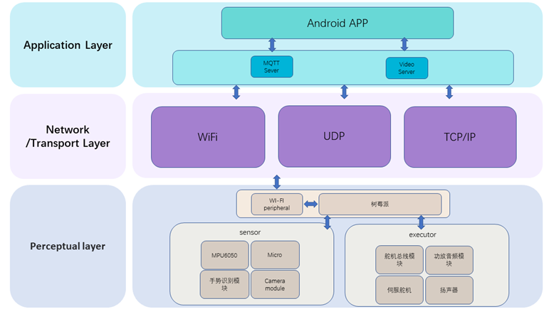
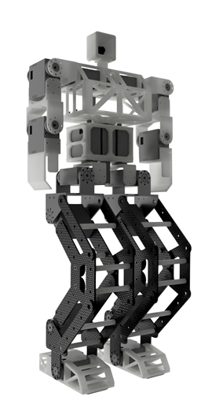

# DBOT
桌面级双足机器人-DOBOT

# 文件说明
robot_catkin_ws :ros工作空间，其中有ROS功能包，及ROS功能包、src、msg等的配置文件

# 项目说明
DBOT-双足人形机器人是基于ROS机器人操作系统进行开发设计的一款桌面级双足人形机器人，在硬件上，采用树莓派为主控板和多个高精度舵机，以10ms的运算周期对机器人的步态进行实时解算，保证步态生成的稳定性，在机械结构上，采用4组四连杆构建作为腿部驱动的关键构件，极大提高了机器人的行走效率，采用运动学算法对机器人进行机器人步态进行实时解算，同时机器人还搭载了IMU模块结合四元数算法进行姿态解算，并通过结合PID算法进行自平衡调节。
在功能上，DBOT-双足人形机器人能够实现机器人的基本的步态行走和自平衡调整，同时机器人还调用了AI语言大模型API,结合Vosk STT模型实现语音智能对话，语音互动，同时机器人还拥有手势互动，APP平台控制互动等功能，同时机器人还拥有人脸识别+追踪功能。我们宗旨是致力于打造一款桌面级智能交互机器人，并对机器人进行模块化设计，使我们机器人不仅能用于桌面娱乐和陪伴，还能应用于教育方面，帮助用户快速实现机器人的搭建。

# 设计
基于DBOT-双足人形机器人项目是一个融合物联网架构与人工智能技术的智能机器人系统，旨在实现双足人形机器人的自主感知、决策与运动控制。其系统架构分为应用层、网络/传输层、感知层，各层协同完成从环境感知到智能执行的全流程。

DBOT-一款双足人形机器人，采用树莓派作为主控核心，集成多种传感器与执行器，并结合MQTT物联网通信协议与手机APP，实现人与机器人的智能交互。机器人配备麦克风，具备语音接收能力，并部署了Vosk语音识别大模型，能够精准识别用户语音内容。通过接入通义千问AI语言大模型，机器人具备自然语言理解与生成能力，实现与人类的智能对话。语音播报模块进一步赋予机器人语言表达能力，使其能“听懂、会说”。机器人还搭载了手势识别模块，极大丰富了交互方式，提升了机器人的趣味性与人机交互体验。机器人功能设计如下，

1.机器人基本行走控制（原地，前进，后退，左转，右转）

2.智能语音对话（接入AI语音大模型）

3.机器人人脸识别+追踪

4.手势识别控制机器人

5.语音交互控制机器人

6.APP 平台交互控制机器人

